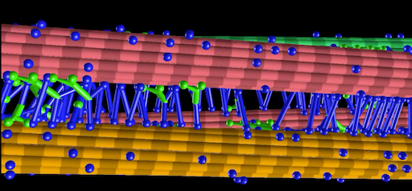
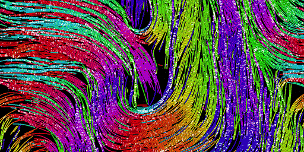
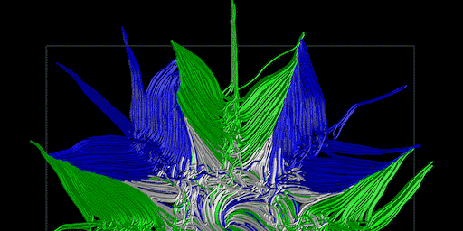
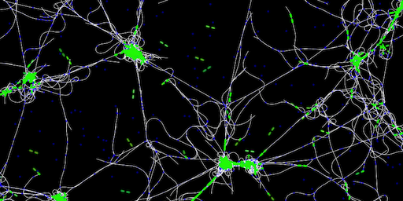
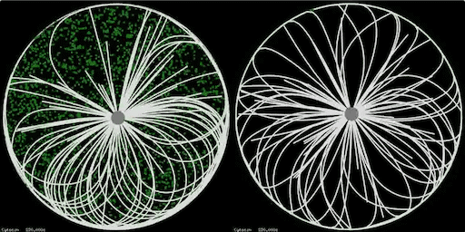
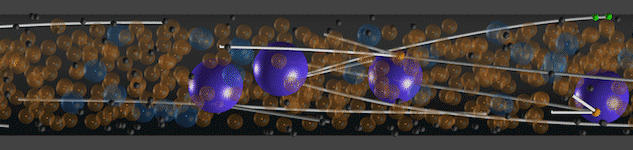
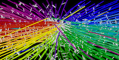
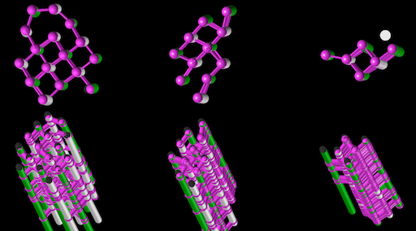

# Projects done with Cytosim

This is a list of some selected work from the Nedelec group using Cytosim.  
[Additional references from other research groups](biblio.md)

[Microtubule overlaps produced by diffusible crosslinkers](https://doi.org/10.1016/j.cub.2019.05.049)  

[Microtubule organization by mitotic motors](https://doi.org/10.1016/j.cell.2018.09.029)  

[Self organization in confined space](http://www.cell.com/current-biology/abstract/S0960-9822(09)01025-2)  

[Optimization of gliding assays](http://pubs.rsc.org/en/Content/ArticleLanding/2012/LC/c2lc40250e#!divAbstract)  

[Mitotic spindle organization](http://www.sciencedirect.com/science/article/pii/S0006349508705137)  

[Dynamic organization of actin](http://www.sciencedirect.com/science/article/pii/S0960982216000543)   

[Contraction of filamentous networks](http://msb.embopress.org/content/13/9/941)  

[Networks with motor minifilaments](http://jcs.biologists.org/content/132/4/jcs219717)  

[Centrosome centering](http://www.molbiolcell.org/content/27/18/2833.short)  

[Formation of microtubules arrays in yeast](http://www.sciencedirect.com/science/article/pii/S0092867407000487)  

[Nuclear movements in multinucleated fungi](http://www.molbiolcell.org/content/28/5/645.abstract)  

[Nuclear movements during development in C.elegans](http://www.cell.com/cell-reports/abstract/S2211-1247(16)30093-6)  

[Endocytosis in yeast](https://doi.org/10.1016/j.cell.2018.06.032)  

[Regulation of spindle length in C.elegans](https://doi.org/10.1016/j.devcel.2018.04.022)  

[Effects of spatial dimensionality and steric interactions on microtubule-motor self-organization.]
(https://doi.org/10.1088/1478-3975/ab0fb1)

[Mitotic spindle design principles]
(https://doi.org/10.7554/eLife.03398)  

[Formation of the microtubule marginal band in blood platelets]
(http://dx.doi.org/10.1073/pnas.1618041114)  

[Mitotic spindle positionning](https://doi.org/10.1016/j.cell.2007.03.027)  

[Chromosome capture](https://doi.org/10.1016/j.cub.2014.05.019)  

[Karyogamy](http://www.genesdev.org/cgi/doi/10.1101/gad.206318.112)  

